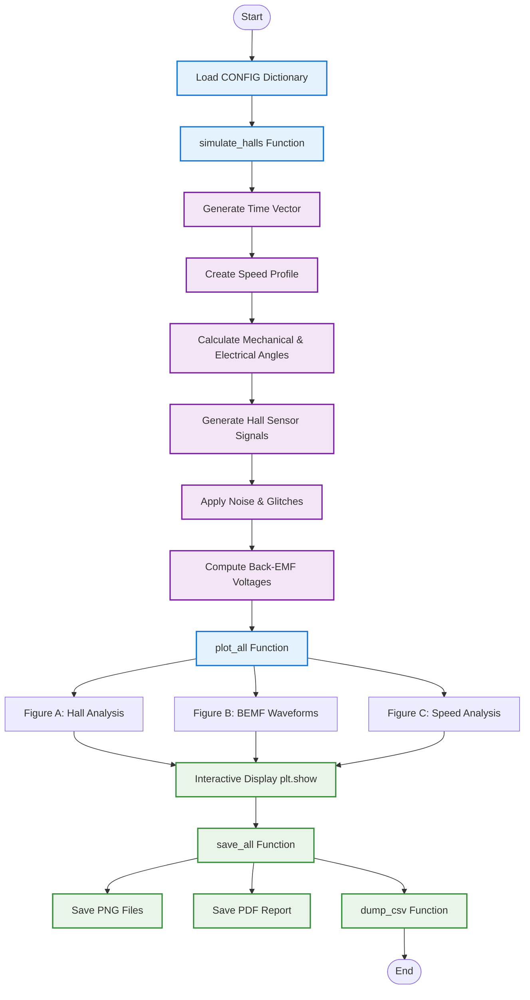
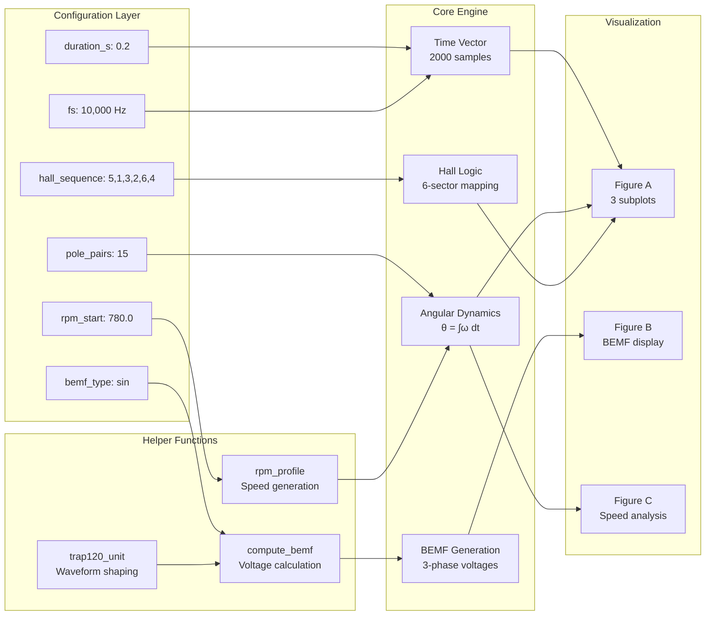

# 🏗️ BLDC_ADVANCED.py Architecture Documentation

## Overview
This document provides a comprehensive architectural analysis of the `BLDC_ADVANCED.py` script, including detailed diagrams showing the system's structure, data flow, and component relationships.

## 📊 Main Architecture Diagram

```mermaid
graph TD
    %% Configuration Layer
    A[CONFIG Dictionary] --> B[Global Parameters]
    B --> B1[Simulation Settings<br/>duration_s, fs]
    B --> B2[Motor Parameters<br/>pole_pairs, hall_sequence]
    B --> B3[Speed Profile<br/>profile_kind, rpm_start/end]
    B --> B4[Noise Settings<br/>jitter, glitch_prob]
    B --> B5[BEMF Settings<br/>bemf_type, ke]
    B --> B6[Output Settings<br/>write_csv, export_pdf]

    %% Helper Functions Layer
    C[Helper Functions] --> C1[rpm_profile]
    C --> C2[_wrap_deg]
    C --> C3[trap120_unit]
    C --> C4[compute_bemf]
    C --> C5[_resolve_markers]

    %% Core Simulation Engine
    D[simulate_halls] --> D1[Time Vector Generation]
    D --> D2[Speed Profile Application]
    D --> D3[Angular Calculations]
    D --> D4[Hall Sensor Logic]
    D --> D5[Noise Simulation]
    D --> D6[BEMF Generation]

    D1 --> D1A["t = arange(0, duration, 1/fs)"]
    D2 --> D2A["rpm = rpm_profile(t, ...)"]
    D2A --> D2B["omega_mech = rpm × 2π/60"]
    D3 --> D3A["theta_mech = cumsum(omega)"]
    D3A --> D3B["theta_e = pole_pairs × theta_mech"]
    D4 --> D4A["sector = theta_e // (π/3)"]
    D4A --> D4B["state = hall_sequence[sector]"]
    D4B --> D4C["HA, HB, HC = bit extraction"]
    D5 --> D5A[Angle Jitter]
    D5A --> D5B[Hall Glitches]
    D6 --> D6A["ea, eb, ec = compute_bemf(...)"]

    %% Visualization System
    E[plot_all] --> E1[Figure A: Hall Analysis]
    E --> E2[Figure B: BEMF Waveforms]
    E --> E3[Figure C: Speed Analysis]

    E1 --> E1A["A1: Hall Waveforms<br/>HA, HB, HC with annotations"]
    E1 --> E1B["A2: True Electrical Angle<br/>Continuous sawtooth"]
    E1 --> E1C["A3: Hall-based Estimate<br/>Staircase pattern"]

    E2 --> E2A["Three-phase BEMF<br/>ea, eb, ec plots"]

    E3 --> E3A["C1: RPM vs Time<br/>with frequency markers"]
    E3 --> E3B["C2: Frequency Mapping<br/>f_elec vs f_mech"]
    E3A --> E3C["Inset: Overlay Runs<br/>Multiple speed profiles"]

    %% Data Processing
    F[Data Export] --> F1[dump_csv]
    F --> F2[save_all]
    F1 --> F1A["CSV Output<br/>hall_sim_output.csv"]
    F2 --> F2A["PNG Images<br/>Individual figures"]
    F2 --> F2B["PDF Report<br/>Combined plots"]

    %% Main Execution Flow
    G[main] --> G1[Load CONFIG]
    G1 --> G2[simulate_halls]
    G2 --> G3[plot_all]
    G3 --> G4["plt.show - Interactive Display"]
    G4 --> G5[save_all]
    G5 --> G6[dump_csv]

    %% Data Flow Connections
    A --> D
    C1 --> D2
    C3 --> C4
    C4 --> D6
    C5 --> E
    D --> E
    E --> F2
    D --> F1

    %% Styling
    classDef config fill:#e1f5fe,stroke:#01579b,stroke-width:2px
    classDef helper fill:#f3e5f5,stroke:#4a148c,stroke-width:2px
    classDef core fill:#e8f5e8,stroke:#1b5e20,stroke-width:2px
    classDef viz fill:#fff3e0,stroke:#e65100,stroke-width:2px
    classDef data fill:#fce4ec,stroke:#880e4f,stroke-width:2px
    classDef main fill:#f1f8e9,stroke:#33691e,stroke-width:3px

    class A,B,B1,B2,B3,B4,B5,B6 config
    class C,C1,C2,C3,C4,C5 helper
    class D,D1,D2,D3,D4,D5,D6,D1A,D2A,D2B,D3A,D3B,D4A,D4B,D4C,D5A,D5B,D6A core
    class E,E1,E2,E3,E1A,E1B,E1C,E2A,E3A,E3B,E3C viz
    class F,F1,F2,F1A,F2A,F2B data
    class G,G1,G2,G3,G4,G5,G6 main
```



## 🔄 Simplified Execution Flow



## 🔧 Detailed Module Breakdown



## 📋 Architecture Components

### 1. Configuration Layer (Blue)
- **Central Control**: Single CONFIG dictionary controls all simulation parameters
- **Modular Design**: Grouped by functionality (simulation, motor, noise, output)
- **Easy Tuning**: Change behavior without code modification

### 2. Helper Functions Layer (Purple)
- **Mathematical Utilities**: Speed profiles, angle wrapping, BEMF shapes
- **Reusable Components**: Functions called by multiple parts of the system
- **Pure Functions**: No side effects, predictable outputs

### 3. Core Simulation Engine (Green)
- **Sequential Processing**: Six main stages with clear data flow
- **Physics Modeling**: Accurate motor dynamics and sensor behavior
- **Noise Injection**: Realistic fault and disturbance simulation

### 4. Visualization System (Orange)
- **Three-Figure Layout**: Organized by analysis type
- **Interactive Display**: Real-time plotting with annotations
- **Professional Presentation**: Publication-ready plots

### 5. Data Export Layer (Pink)
- **Multiple Formats**: CSV for analysis, PNG for presentation, PDF for reports
- **Complete Data**: All simulation variables preserved
- **Post-Processing Ready**: Structured output for external tools

### 6. Main Execution Flow (Light Green)
- **Linear Workflow**: Clear sequence from config to output
- **Interactive First**: Show plots before saving
- **Error Handling**: Graceful backend switching

## 🔍 Key Data Structures

### Primary Simulation Output Dictionary
```python
sim = {
    "t": time_vector,                    # Time samples [s]
    "rpm": speed_profile,                # Mechanical speed [RPM]
    "theta_mech_rad": mechanical_angle,  # Mechanical position [rad]
    "theta_e_deg_true": electrical_angle,# Electrical position [deg]
    "HA", "HB", "HC": hall_sensors,      # Digital Hall signals
    "HallState": combined_state,         # 3-bit Hall state
    "ea", "eb", "ec": bemf_voltages      # Back-EMF voltages [V]
}
```

### Helper Function Dependencies
- `rpm_profile` → Speed generation
- `compute_bemf` → Voltage calculation  
- `trap120_unit` → Waveform shaping
- `_resolve_markers` → Annotation placement

## 🎯 Design Principles

1. **Separation of Concerns**: Each module has a single responsibility
2. **Configuration-Driven**: Behavior controlled by parameters, not code changes
3. **Modular Architecture**: Components can be tested and modified independently
4. **Data Pipeline**: Clear flow from input parameters to output files
5. **Interactive Design**: User can see results before committing to file export
6. **Professional Output**: Multiple export formats for different use cases

## 🚀 Usage Examples

### Basic Configuration
```python
CONFIG = {
    "duration_s": 0.2,               # 200ms simulation
    "fs": 10_000,                    # 10kHz sampling
    "pole_pairs": 15,                # 15 pole pair motor
    "rpm_start": 780.0,              # Initial speed
    "rpm_end": 0.0,                  # Final speed
    "bemf_type": "sin",              # Sinusoidal BEMF
}
```

### Advanced Noise Testing
```python
CONFIG.update({
    "jitter_deg_electrical": 2.0,    # ±2° sensor noise
    "glitch_prob": 1e-5,             # 0.001% bit error rate
    "bemf_type": "trap",             # Trapezoidal BEMF
})
```

## 📊 Performance Characteristics

- **Memory Usage**: ~2000 samples × 10 signals = 20k data points
- **Execution Time**: <1 second for 0.2s simulation
- **Scalability**: Linear with simulation duration
- **Accuracy**: Hall angle error ≤ 30° (half sector)

This architecture makes `BLDC_ADVANCED.py` a **professional-grade simulation tool** for motor control engineering applications, educational purposes, and controller development.

---

*Generated on: 2025-08-29 09:23:51 UTC*  
*Repository: FungGor/Motor_Simulation*  
*Author: FungGor*