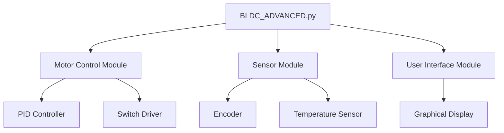
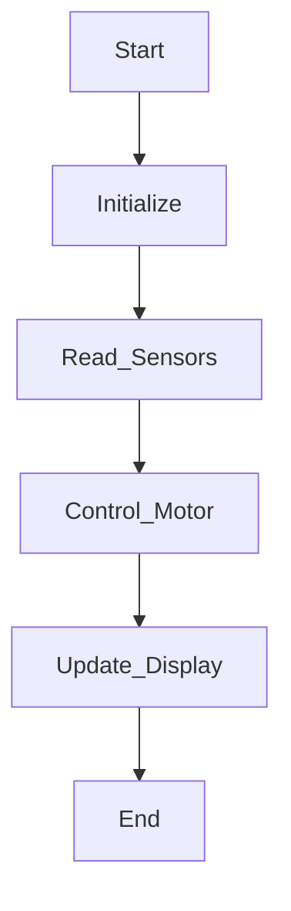
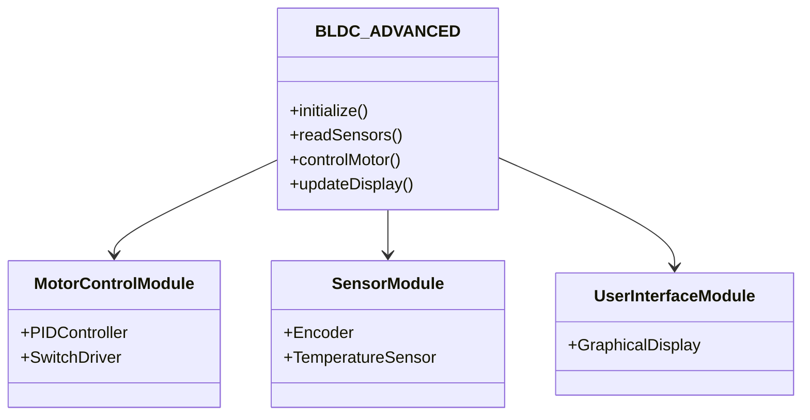

# BLDC_ADVANCED Architecture

## Overview

This document provides a comprehensive architecture overview of the `BLDC_ADVANCED.py` script, including diagrams to illustrate the overall architecture, simplified flow, and detailed module breakdown.

## Overall Architecture

## Simplified Flow

## Detailed Module Breakdown

